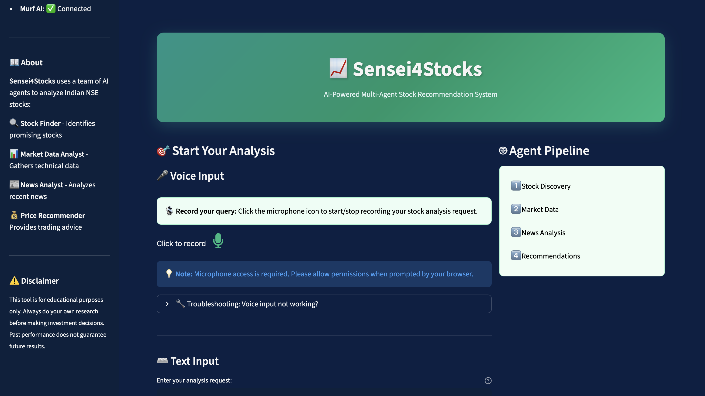
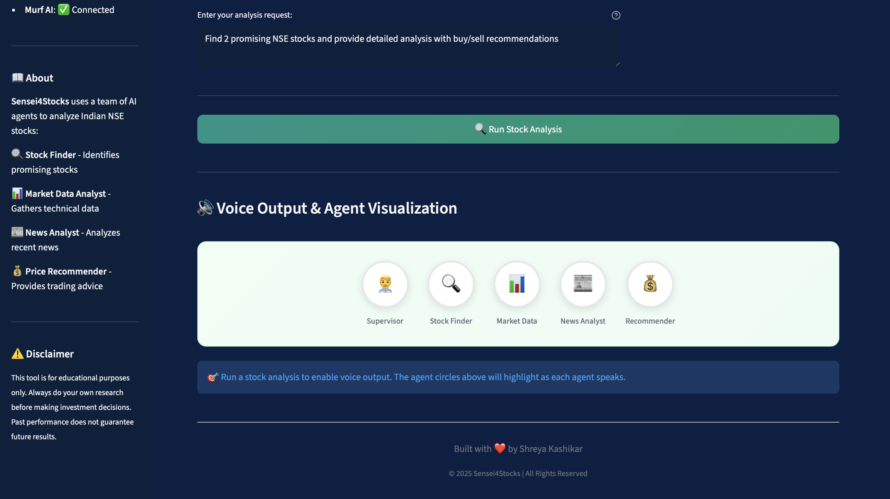

# 📈 Sensei4Stocks - Multi-Agent debate for Stocks Recommendation

This project demonstrates how LLM-driven agents can collaborate to fetch data and generate guidance for the Indian Stock Market (NSE).


---

## 🚀 Live Demo

Deploy your own instance using the instructions below!

### Demo Video

<a href="https://drive.google.com/file/d/1Suioy4nQ8zz2N4Geg-RvPmPybRsHCGZV/view?usp=share_link" target="_blank"> Sensei4Stocks </a>

### Screenshot




---

## 🧩 Overview

The system is built around four specialized AI agents:

| Agent | Role |
|-------|------|
| 🔍 **Stock Finder** | Identifies promising NSE-listed stocks based on recent performance, news buzz, volume, or technical strength |
| 📊 **Market Data Analyst** | Gathers technical data including price, volume, trends, RSI, and moving averages |
| 📰 **News Analyst** | Analyzes recent news articles and classifies sentiment as positive, negative, or neutral |
| 💰 **Price Recommender** | Provides actionable Buy/Sell/Hold recommendations with target prices |

A **Supervisor agent** orchestrates the workflow between these agents using LangGraph.

---

## ✨ Features

- **Professional Streamlit UI** - Clean, modern interface for stock analysis
- **Multi-Agent AI System** - Four specialized agents working together
- **Real-time Progress** - Watch agents work in real-time
- **Quick Analysis Options** - Pre-built queries for common use cases
- **🎤 Speech-to-Text** - Voice input using Murf AI for hands-free queries
- **🔊 Voice Output** - Multi-agent debate style audio summaries (optional)
- **Responsive Design** - Works on desktop and mobile

---

## 🛠️ Installation


### Local Setup

1. **Clone the repository**
   ```bash
   git clone https://github.com/shreyakash24/Sensei4Stocks.git
   cd Sensei4Stocks
   ```

2. **Create a virtual environment**
   ```bash
   python -m venv venv
   source venv/bin/activate  # On Windows: venv\Scripts\activate
   ```

3. **Install dependencies**
   ```bash
   pip install -r requirements.txt
   ```

4. **Set up environment variables**
   
   Create a `.env` file in the project root:
   ```env
   # Required
   GROQ_API_KEY=your_groq_api_key
   BRIGHT_DATA_API_TOKEN=your_bright_data_token
   
   # Optional - for voice output
   MURF_API_KEY=your_murf_api_key
   
   # Optional - Bright Data zones
   WEB_UNLOCKER_ZONE=unblocker
   BROWSER_ZONE=scraping_browser
   ```

5. **Run the application**
   ```bash
   streamlit run app.py
   ```

6. **Open your browser** at `http://localhost:8501`

---

## 🔑 Environment Variables

### Required

| Variable | Description |
|----------|-------------|
| `GROQ_API_KEY` | Your GROQ API key for LLM access |
| `BRIGHT_DATA_API_TOKEN` | Bright Data API token for web scraping |

### Optional - Bright Data Configuration

| Variable | Default | Description |
|----------|---------|-------------|
| `WEB_UNLOCKER_ZONE` | unblocker | Web Unlocker zone name |
| `BROWSER_ZONE` | scraping_browser | Browser zone name |

### Optional - Voice Output (Murf AI)

| Variable | Default | Description |
|----------|---------|-------------|
| `MURF_API_KEY` | - | Your Murf AI API key |
| `MURF_VOICE_STOCK_FINDER` | Matthew | Voice for Stock Finder Agent |
| `MURF_VOICE_MARKET_DATA` | Julia | Voice for Market Data Agent |
| `MURF_VOICE_NEWS_ANALYST` | Ken | Voice for News Analyst Agent |
| `MURF_VOICE_RECOMMENDER` | Rachel | Voice for Price Recommender Agent |
| `MURF_VOICE_SUPERVISOR` | Natalie | Voice for Supervisor |
| `MURF_MODEL` | FALCON | Murf AI model to use |
| `MURF_LOCALE` | en-US | Language/locale setting |
| `MURF_SAMPLE_RATE` | 24000 | Audio sample rate |

---

## ⚠️ Disclaimer

The stock recommendations provided by the AI agents should not be considered as final advice.

- Always do your own research before making investment decisions
- Past performance does not guarantee future results
- Consult with a qualified financial advisor for investment decisions

---


